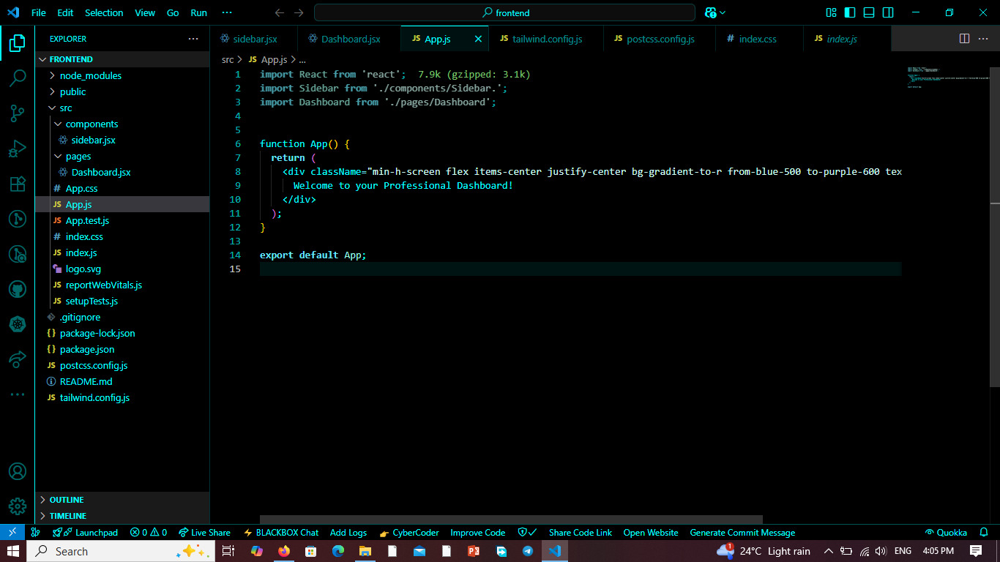
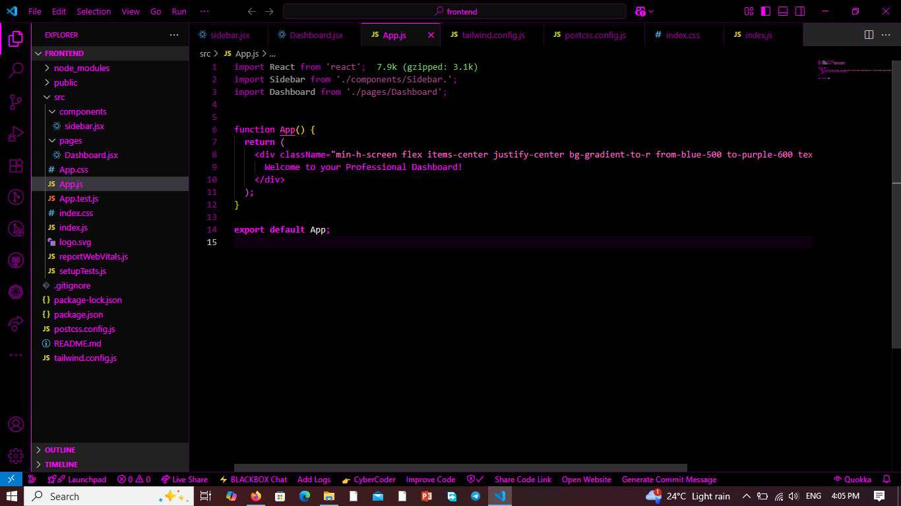
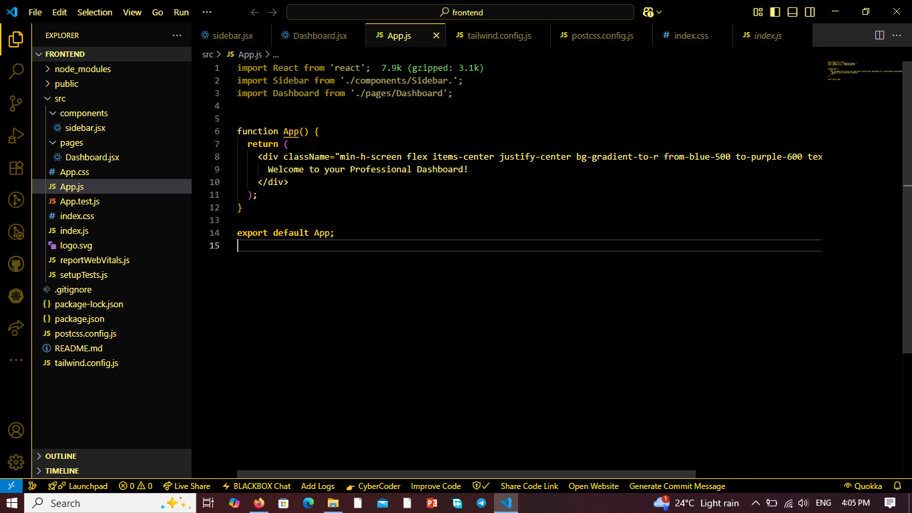
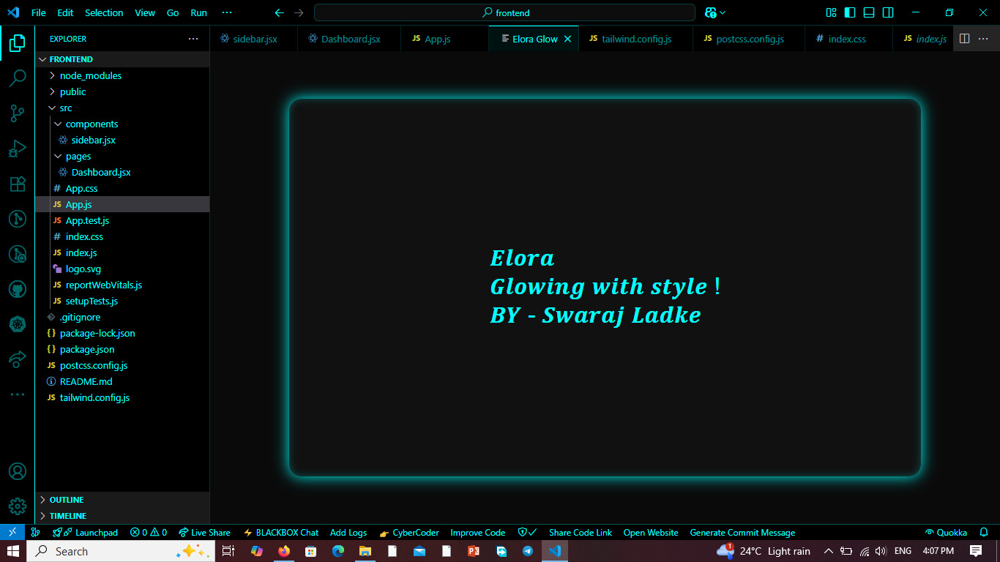

# 🌈 Elora - Dynamic Glow Theme Engine for VS Code

**Elora** is a next-gen **dynamic glowing theme engine** for Visual Studio Code. It brings your editor to life with **real-time glowing animations** that respond to your current theme color — adding an aesthetic and immersive coding experience.

> 💡 Created with ❤️ by [Swaraj Ladke](https://github.com/swarajladke)

---

## ✨ Features

- 🎨 Glowing UI that adapts to your current Elora theme color
- 💫 Animated glowing borders inside a webview (simulating file explorer glow)
- 🎯 Smooth animations with customizable colors
- ⚙️ Designed to match your theme dynamically (e.g. Pink glow for Elora Pink)

---

## 🎥 Demo

<p float="left">
  
  
  
  
</p>


---

## 🛠️ Usage

1. Open Command Palette → `Elora: Show Glow Panel`
2. Enjoy a glowing animated panel themed to match your selected Elora color theme
3. Works great with your existing VS Code setup

---

## 🎨 Supported Themes & Glow Colors

| Theme Name      | Glow Color  |
|-----------------|-------------|
| Elora Pink      | `#ff69b4`   |
| Elora Blue      | `#00aaff`   |
| Elora Green     | `#00ff99`   |
| Elora Red       | `#ff4444`   |
| Elora Aqua      | `#00ffff`   |
| Elora Orange    | `#ff8800`   |
| Elora Yellow    | `#ffff33`   |
| Elora Lime      | `#ccff00`   |
| Elora Magenta   | `#ff00ff`   |
| Elora Cyan      | `#00e5ff`   |
| Elora Rainbow   | `#ffffff` *(default / animated coming soon)*

---

## 🔧 Tech Stack

- **TypeScript**
- **VS Code API**
- **Webview Panels**
- **CSS Keyframe Animations**

---

## 🚀 Installation

```bash
git clone https://github.com/swarajladke/Elora.git
cd Elora
npm install
code .
